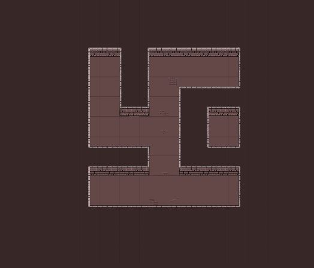
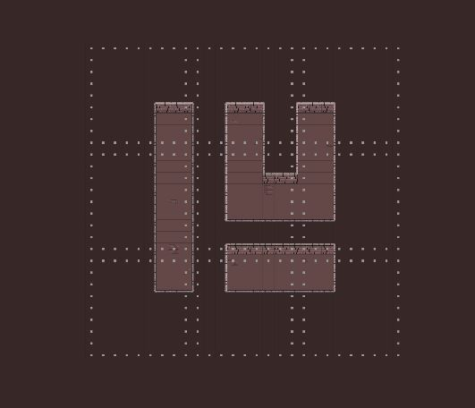
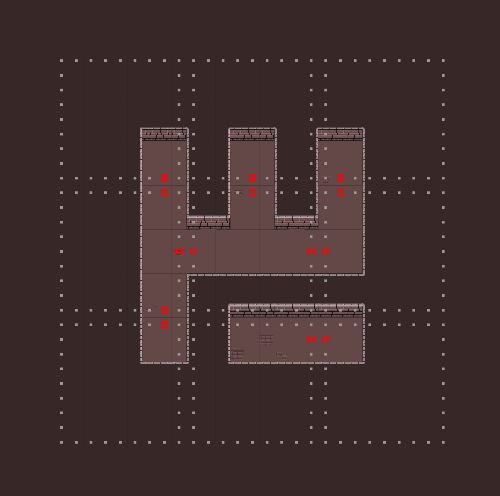
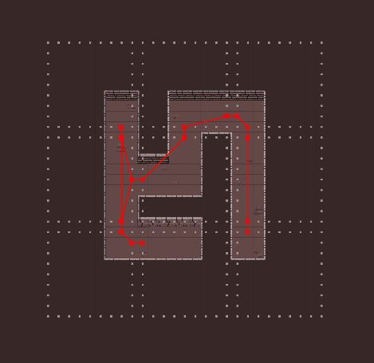
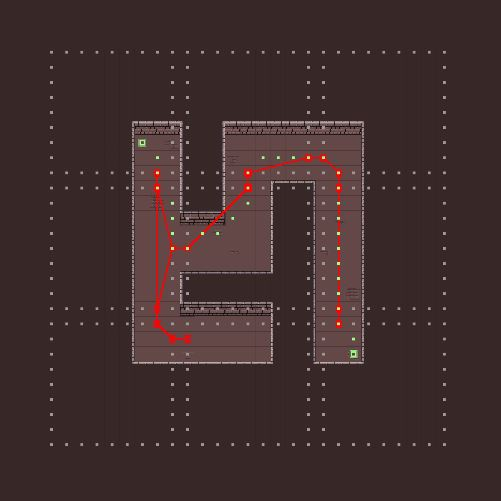
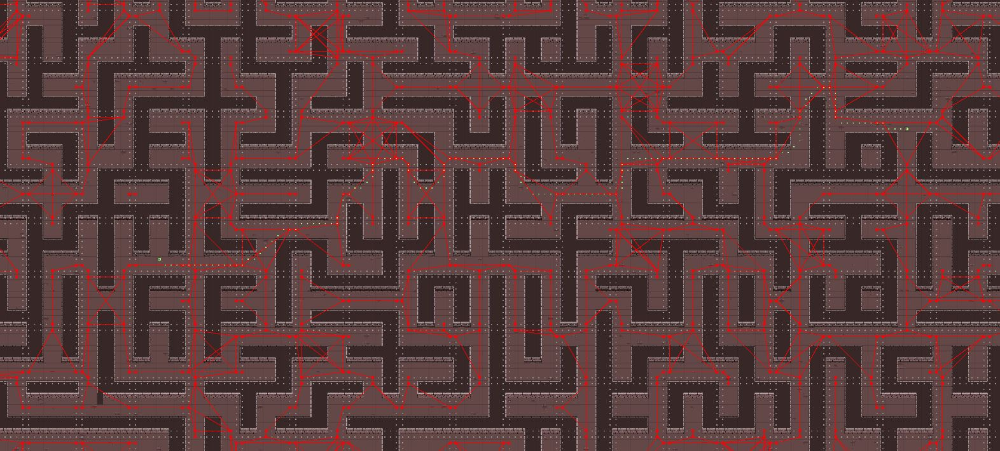
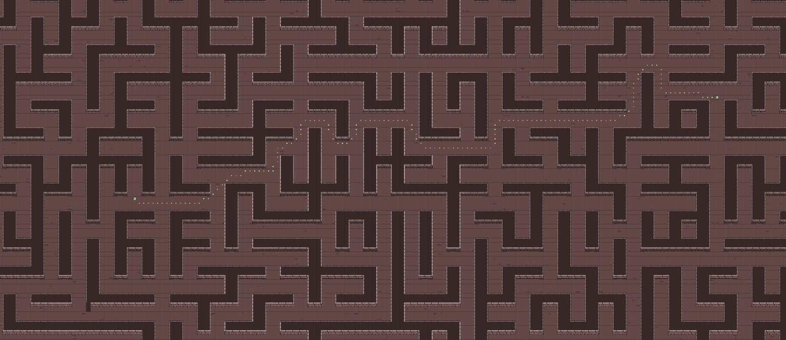

# HierachicalPathFinding A*
## Description:
It is an alternative approach to pathfinding.
 While you normally would use A* or breath or depth first search.
In Hierarchical pathfinding we pre calculate the world first and construct a graph of it.
 We will then use this graph to find a general path through our world and only will have to
 find a path from our start node to our graph and our goal node to our graph.
  If you want to read more on the topic, 
[this](http://citeseerx.ist.psu.edu/viewdoc/download?doi=10.1.1.479.4675&rep=rep1&type=pdf) is the paper
 I followed for my implementation.

## Implementation:
Obviously, we firs need a world before we can pathfind in a world we first need a world.
 So, I created a simple world generator on a 2d grid as test platform for my implementation.

*Picture of the world*

After we have the world, we need to process the world before we can start pathfinding with.
 First we divide the world into clusters as shown in the picture below.

*Picture of clusters*

After we have the clusters we can check their boarders for entrances to the other clusters,
 so we will check if there is no wall in our cluster on the border or on our neighbouring clusters boarder.
 If we have more then 3 of these entrances next to each other,
 we will only keep the outer ones since the entrances in the middle are unnecessary.

*Picture of cluster with entrances*

Of course, the entrances will be just nodes in our abstract graph of our world so we will
 connect them with each other as shown in the next picture.
 These connections will just have a weight of one. After we have connected our cluster to his neighbours,
 we take care of the connections of the entrances to other entrances in the same cluster.
 We do this by just finding the path to another entrance in the cluster with A* and add the heuristic weight
 as the connection weight, I don’t save the path.

*Picture of clusters with entrances*

Once we do this, we have a graph we can use to navigate our world.
 The next step is to use this graph.
 I did that by just connecting the start node to the graph as well as the goal node,
 then we can just do an A* search on our graph and pathfind from entrance to entrance with A* as well.

*Picture of final result*

## Result:
The result I got was not the optimal path as depth first or A* but a bit less optimal.
 But its still not a strange path. It doesn’t take unnecessary detours.
 What is better is that it it’s a lot faster than if I just run A* on my world to find the path.
 I tried it in quite a big world and while I had to wait for A* to finish
 the Hierarchical implementation was almost instantaneous.

## Future Work:
It might be very interesting to make an implementation of it in Minecraft.
 Since its already divided up in chunks.
 We could just calculate the extra nodes and connections
 for that chunk and add it to or already existing graph of the world.
 
Another improvement on this would be to implement this on a navmesh,
 there is already a paper out there which goes further into depth about [that](https://www.sciencedirect.com/science/article/abs/pii/S0097849316300668#:~:text=Hierarchical%20path%2Dfinding%20aims%20to,memory%20footprint%20when%20calculating%20paths.)